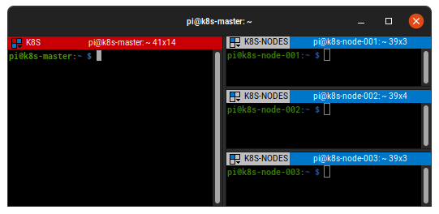
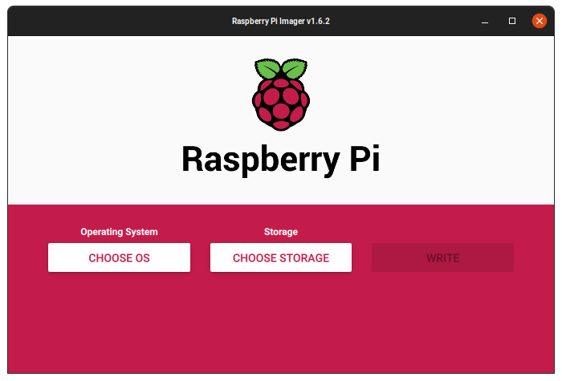
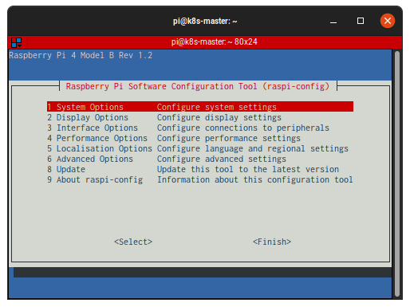

# Provisioning Compute Resources

Kubernetes requires a set of machines to host the Kubernetes control plane and the worker nodes where containers are ultimately run. 

In this lab, you will set up your Raspberry PI 4 devices, put them on the network and make them ready to start.

In my lab, I expose my Kubernetes Controller Device to the internet using a Virtual Server from my TP-Link Home Router. Using my DDNS configuration, I use the domain name EXTERNAL_IP, like the GCP Load Balancer works.

This lab is simpler than the original and should be used to have fun!




## Networking

The Kubernetes [networking model](https://kubernetes.io/docs/concepts/cluster-administration/networking/#kubernetes-model) assumes a flat network in which containers and nodes can communicate with each other. In cases where this is not desired [network policies](https://kubernetes.io/docs/concepts/services-networking/network-policies/) can limit how groups of containers are allowed to communicate with each other and external network endpoints.

> Setting up network policies is out of scope for this tutorial.

### Virtual Private Cloud Network

In this section a dedicated [Virtual Private Cloud](https://cloud.google.com/compute/docs/networks-and-firewalls#networks) (VPC) network will be setup to host the Kubernetes cluster.

Create the `kubernetes-the-hard-way` custom VPC network:

```
gcloud compute networks create kubernetes-the-hard-way --subnet-mode custom
```

A [subnet](https://cloud.google.com/compute/docs/vpc/#vpc_networks_and_subnets) must be provisioned with an IP address range large enough to assign a private IP address to each node in the Kubernetes cluster.

Create the `kubernetes` subnet in the `kubernetes-the-hard-way` VPC network:

```
gcloud compute networks subnets create kubernetes \
  --network kubernetes-the-hard-way \
  --range 10.240.0.0/24
```

> The `10.240.0.0/24` IP address range can host up to 254 compute instances.

### ~~Firewall Rules~~


### ~~Kubernetes Public IP Address~~ DDNS and Virtual Server

~~Allocate a static IP address that will be attached to the external load balancer fronting the Kubernetes API Servers~~

I configured my TP-Router to expose the Controller Node to internet using DDNS and Virtual Servers. The config is very different depending of your router brand or network configuration.

## ~~Compute Instances~~ Raspberry PI

The compute instances in this lab will be provisioned using [Raspberry PI OS Lite](https://www.raspberrypi.com/software/operating-systems/) but the unlisted 64 Bit. Each instance will be set up with a fixed private IP address to simplify the Kubernetes bootstrapping process.

### Raspberry OS 64 Bit

I used the brand new Raspberry OS Lite based on Debian Bullseye, but the 64-bit arm version. You can download it from [here](https://downloads.raspberrypi.org/raspios_lite_arm64/images/raspios_lite_arm64-2021-11-08/2021-10-30-raspios-bullseye-arm64-lite.zip).

After this, you can write the image to SD Card using the Raspberry PI Imager using this [tutorial](https://www.raspberrypi.com/news/raspberry-pi-imager-imaging-utility/). When you choose the image, choose 'Choose Custom' and point to the zip image file that you downloaded before.



### Common Config

There are few customizations to do at the first boot for each RPi. 

> The default user is `pi` and the password is `raspberry`.

After boot your RPi, you need to use the raspi-config command:

```
sudo raspi-config
```



You should change these options:
* 3 Interface Options > I2 SSH > Enable
* 4 Performance Options > P2 GPU Memory > 16 (More RAM for us!)
* 6 Advanced Options > A1 Expand FileSystem (More space to your SD card)

To set the machine name, use this command:

```
hostnamectl set-hostname <name>
```

You need to use static IPs to your RPIs. You can config static IP using Debian or define it using your Router and Mac Addresses.

> Config static IP in Debian not work for me for unknown reason. I fix then it using my router. This is better if you use the Virtual Server like me. :-)

At the end, we need to config these fixed IPs to /etc/hosts file (each node and your computer):

```
192.168.0.250   k8s-master
192.168.0.251   k8s-node-001
192.168.0.252   k8s-node-002
192.168.0.253   k8s-node-003

```

### Kubernetes Controllers

~~Create three compute instances which will host the Kubernetes control plane:~~

Configure one of RPI devices to be the Controller. I named it as k8s-master.


### Kubernetes Workers

Each worker instance requires a pod subnet allocation from the Kubernetes cluster CIDR range. The pod subnet allocation will be used to configure container networking in a later exercise. The `pod-cidr` instance metadata will be used to expose pod subnet allocations to compute instances at runtime.

> The Kubernetes cluster CIDR range is defined by the Controller Manager's `--cluster-cidr` flag. In this tutorial the cluster CIDR range will be set to `10.200.0.0/16`, which supports 254 subnets.

Create three compute instances which will host the Kubernetes worker nodes:

```
for i in 0 1 2; do
  gcloud compute instances create worker-${i} \
    --async \
    --boot-disk-size 200GB \
    --can-ip-forward \
    --image-family ubuntu-2004-lts \
    --image-project ubuntu-os-cloud \
    --machine-type e2-standard-2 \
    --metadata pod-cidr=10.200.${i}.0/24 \
    --private-network-ip 10.240.0.2${i} \
    --scopes compute-rw,storage-ro,service-management,service-control,logging-write,monitoring \
    --subnet kubernetes \
    --tags kubernetes-the-hard-way,worker
done
```

### Verification

List the compute instances in your default compute zone:

```
gcloud compute instances list --filter="tags.items=kubernetes-the-hard-way"
```

> output

```
NAME          ZONE        MACHINE_TYPE   PREEMPTIBLE  INTERNAL_IP  EXTERNAL_IP    STATUS
controller-0  us-west1-c  e2-standard-2               10.240.0.10  XX.XX.XX.XXX   RUNNING
controller-1  us-west1-c  e2-standard-2               10.240.0.11  XX.XXX.XXX.XX  RUNNING
controller-2  us-west1-c  e2-standard-2               10.240.0.12  XX.XXX.XX.XXX  RUNNING
worker-0      us-west1-c  e2-standard-2               10.240.0.20  XX.XX.XXX.XXX  RUNNING
worker-1      us-west1-c  e2-standard-2               10.240.0.21  XX.XX.XX.XXX   RUNNING
worker-2      us-west1-c  e2-standard-2               10.240.0.22  XX.XXX.XX.XX   RUNNING
```

## Configuring SSH Access

SSH will be used to configure the controller and worker instances. 
Test SSH access to the `k8s-master` compute instances:

```
ssh pi@k8s-master
```

After the SSH ip fingerprint have been accepted you'll be logged into the `k8s-master` instance:

```
Linux k8s-master 5.10.63-v8+ #1459 SMP PREEMPT Wed Oct 6 16:42:49 BST 2021 aarch64
...
```

Use `Ctrl+D` or `exit` at the prompt to exit the `k8s-master` compute instance:

```
pi@k8s-master:~$ exit
```
Next: [Provisioning a CA and Generating TLS Certificates](04-certificate-authority.md)
